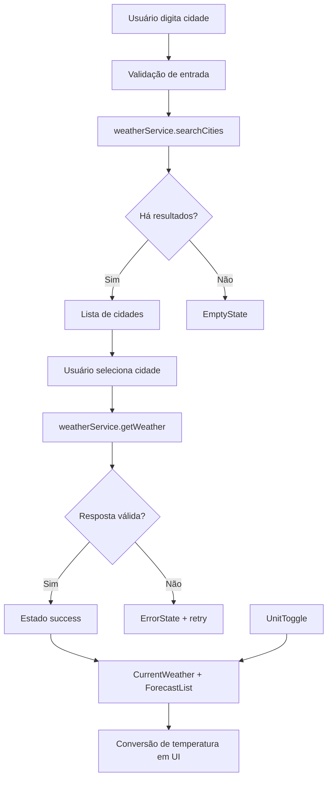

# Weather App — Plano Técnico

## Architecture (Overview)

A aplicação será construída como uma Single Page Application (SPA) em React com Vite e TypeScript, focada em uma experiência de consulta climática rápida, responsiva e acessível em dispositivos móveis.

A arquitetura será organizada em camadas para manter a separação entre interface, lógica de fluxo, integração com APIs externas e regras de negócio puras:

- Camada de apresentação: componentes React responsáveis por renderizar a UI, receber props e disparar interações do usuário.
- Camada de orquestração: hooks e estado local para controlar busca, carregamento, erros, seleção de cidade e unidade de temperatura.
- Camada de serviços: funções isoladas para consultar geocodificação e previsão meteorológica na API Open-Meteo.
- Camada de domínio: utilitários para conversão de temperatura, mapeamento de códigos de clima e formatação de datas.
- Camada de tipos: contratos TypeScript compartilhados entre componentes, hooks e serviços.

A aplicação seguirá um fluxo unidirecional: o usuário pesquisa uma cidade, o serviço busca resultados, o usuário seleciona um resultado, a aplicação carrega o clima atual e a previsão de cinco dias, e a UI re-renderiza a partir do estado atualizado. A troca de unidade de temperatura será tratada como transformação derivada da visualização, sem necessidade de nova chamada à API.

---

## Tech Stack

| Camada | Tecnologia | Motivo da escolha |
| --- | --- | --- |
| Linguagem | TypeScript (strict) | Segurança de tipos e melhor manutenção do contrato de dados |
| UI | React 19 | Estrutura declarativa e componentes reutilizáveis |
| Build / dev server | Vite | Inicialização rápida e fluxo de desenvolvimento ágil |
| Estilo | Tailwind CSS | Prototipação rápida e design consistente com tema dark glassmorphism |
| Testes unitários | Vitest + Testing Library | Excelente integração com Vite e validação de comportamento do usuário |
| Testes E2E | Playwright | Cobertura de fluxos reais em viewport mobile e desktop |
| API externa | Open-Meteo | Gratuita, sem chave, adequada para um projeto de treinamento |
| Lint / qualidade | Biome | Validação rápida e padronização do código |

Decisão de arquitetura: usar apenas React, TypeScript e APIs HTTP nativas, sem biblioteca de estado global para esta primeira versão. A complexidade é pequena o suficiente para o estado local e hooks compartilhados resolverem a necessidade de forma simples e previsível.

---

## Project Structure

```text
src/
├── App.tsx
├── main.tsx
├── index.css
├── components/
│   ├── SearchBar.tsx
│   ├── CityResults.tsx
│   ├── CurrentWeather.tsx
│   ├── ForecastList.tsx
│   ├── ForecastCard.tsx
│   ├── UnitToggle.tsx
│   └── states/
│       ├── LoadingState.tsx
│       ├── EmptyState.tsx
│       └── ErrorState.tsx
├── hooks/
│   └── useWeather.ts
├── services/
│   └── weatherService.ts
├── lib/
│   ├── temperature.ts
│   ├── weatherCodes.ts
│   ├── formatDate.ts
│   └── validation.ts
├── types/
│   └── weather.ts
└── utils/
    └── helpers.ts
```

A organização prioriza:

- componentes focados em UI e responsabilidade única;
- serviços dedicados à integração externa;
- hooks para lógica de fluxo de dados;
- utilitários puros para conversão e apresentação;
- tipos explícitos para evitar inconsistência entre API e UI.

---

## Data Model

Os dados serão modelados em TypeScript para refletir os contratos da API e as necessidades da interface.

```ts
export type TemperatureUnit = 'celsius' | 'fahrenheit';

export interface CitySearchResult {
  id: number;
  name: string;
  country: string;
  admin1?: string;
  latitude: number;
  longitude: number;
}

export interface CurrentWeather {
  temperatureC: number;
  weatherCode: number;
  humidity: number;
  windSpeed: number;
  time: string;
}

export interface ForecastDay {
  date: string;
  weatherCode: number;
  minTempC: number;
  maxTempC: number;
}

export interface WeatherResponse {
  city: CitySearchResult;
  current: CurrentWeather;
  forecast: ForecastDay[];
}
```

Decisão importante: o modelo interno será mantido em Celsius para simplificar regra de negócio e evitar duplicação de dados. A conversão para Fahrenheit será aplicada apenas na renderização da interface, com base em uma fórmula determinística.

---

## Data Flow

O fluxo principal da aplicação será:

1. O usuário digita uma cidade no campo de busca.
2. O componente `SearchBar` dispara a busca no hook `useWeather`.
3. O serviço `weatherService.searchCities` chama a API de geocodificação do Open-Meteo.
4. A resposta é validada e mapeada para objetos `CitySearchResult`.
5. O usuário seleciona uma cidade e o hook inicia a consulta de clima.
6. O serviço `weatherService.getWeather` busca `current` e `daily` para a cidade selecionada.
7. Os dados são processados, validados e armazenados no estado da aplicação.
8. `CurrentWeather` e `ForecastList` renderizam os dados na tela.
9. O usuário alterna a unidade; a interface converte os valores em tempo real sem nova requisição.



---

## External APIs

### 1. Geocodificação

Endpoint principal:

```text
https://geocoding-api.open-meteo.com/v1/search
```

Parâmetros esperados:

- `name`: texto digitado pelo usuário
- `count`: até 5 resultados
- `language`: `pt`
- `format`: `json`

Objetivo: localizar cidades e retornar nome, país, região e coordenadas geográficas.

### 2. Previsão climática

Endpoint principal:

```text
https://api.open-meteo.com/v1/forecast
```

Parâmetros esperados:

- `latitude`
- `longitude`
- `current=temperature_2m,relative_humidity_2m,wind_speed_10m,weather_code`
- `daily=weather_code,temperature_2m_max,temperature_2m_min`
- `forecast_days=5`
- `timezone=auto`

Objetivo: ler os dados atuais e a previsão dos próximos cinco dias. A aplicação converterá valores internos para uso na UI e analisar os códigos climáticos para renderizar ícones e descrições em português.

Validação de contrato: a aplicação não deve renderizar dados incompletos. Antes de popular a UI, deve verificar campos essenciais, limites de retorno e presença de dados mínimos para clima atual e previsão.

---

## State Management

O gerenciamento de estado será local, usando React hooks, sem biblioteca adicional de gerenciamento global.

### Estado principal

O hook `useWeather` será responsável por manter o estado da aplicação em um modelo simples:

- `status`: `idle | loading | success | empty | error`
- `cityResults`: lista de cidades sugeridas
- `selectedCity`: cidade ativa
- `weatherData`: dados do clima atual + previsão
- `unit`: `celsius | fahrenheit`
- `errorMessage`: mensagem do erro atual

### Vantagens

- Reduz dependências externas.
- Mantém a lógica encapsulada e fácil de testar.
- Permite que a UI reaja de forma previsível a eventos do usuário e a respostas da API.

### Regras de sincronização

- a cidade selecionada deve ter prioridade sobre resultados antigos;
- consultas concorrentes devem evitar sobrescrever estado de uma busca mais recente;
- a conversão de unidade não deve disparar nova rede;
- a UI deve refletir imediatamente o estado de carregamento, erro e vazio.

---

## Error Handling

A estratégia de tratamento de erro será orientada a recuperação e usabilidade.

### Cenários cobertos

- entrada vazia ou inválida;
- busca sem resultados;
- timeout de 10 segundos;
- falha de rede ou indisponibilidade da API;
- resposta de API incompleta ou com campos ausentes;
- requisições concorrentes que podem chegar fora de ordem.

### Padrão de tratamento

- o serviço externo deve encapsular erros e lançar uma exceção tipada;
- o hook deve transformar a exceção em estado `error` com mensagem amigável;
- a UI deve exibir `ErrorState` com ação explícita de “Tentar novamente”;
- a interface deve permanecer utilizável, sem bloquear o restante da aplicação;
- quando houver falha em uma nova consulta, o estado anterior deve ser preservado apenas como contexto histórico, não como dado atual válido.

### Tratamento de timeout

Será usado `AbortController` para cancelar requisições que excedam o limite estabelecido e apresentar um feedback claro ao usuário.

---

## Testing Strategy

A estratégia de testes será dividida em duas camadas: unitária e de fluxo de usuário.

### Testes unitários

Cobrirão as partes mais críticas e isoladas da lógica:

- conversão de Celsius para Fahrenheit;
- validação de input de busca;
- seleção de cidade e priorização de resultados;
- mapeamento de resposta da API para modelos internos;
- renderização de estados: loading, empty, error e success;
- formatação de datas e códigos climáticos.

Ferramentas:

- Vitest
- Testing Library
- `@testing-library/user-event`

### Testes E2E

A abordagem Playwright validará os principais fluxos do usuário:

1. pesquisar cidade;
2. selecionar resultado;
3. visualizar clima atual;
4. visualizar previsão de cinco dias;
5. alternar entre °C e °F;
6. validar cenário de erro e retry;
7. verificar layout e acessibilidade em viewport mobile.

Esses testes serão executados com `page.route` para mockar respostas da API e garantir previsibilidade no ambiente de validação.

---

## Risks & Trade-offs

### 1. Dependência de API externa

A aplicação depende da disponibilidade da Open-Meteo. Isso cria risco de falha de rede e de dados ausentes, mas o projeto foi arquitetado para lidar com erros sem quebrar a interface.

### 2. Simplificação do gerenciamento de estado

O uso de hook local reduz a complexidade e as dependências, mas também implica que a lógica de sincronização deve ser cuidadosamente escrita para evitar conflitos entre consultas concorrentes.

### 3. Manutenção do modelo interno em Celsius

Essa decisão simplifica a lógica e a conversão, porém exige disciplina na conversão na camada de apresentação. O ganho em consistência supera o custo operacional.

### 4. Escopo controlado da primeira versão

A aplicação não inclui autenticação, cache avançado, geolocalização ou histórico. Essa escolha reduz risco e acelera entregas, mas define explicitamente que essas funcionalidades serão evoluções futuras.

### 5. Trade-off de UX vs. simplicidade

A interface será direta e funcional, priorizando clareza, responsividade e análise rápida de dados climáticos sobre recursos mais elaborados, como dashboard complexo ou múltiplos filtros.

---

## Conclusão

O plano técnico define uma aplicação React + TypeScript + Vite com integração direta à Open-Meteo, separação clara de responsabilidades, tratamento robusto de erro e validação em múltiplos níveis. A arquitetura prioriza simplicidade, rapidez de desenvolvimento, desempenho e qualidade de experiência, mantendo o projeto alinhado com a especificação e com a prova de conceito da Weather App.
